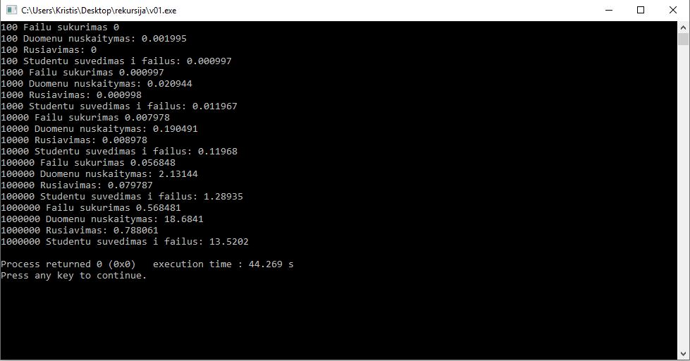

# 2-uzd
# ***v0.1***

Programa geba suskaičiuoti galutini rezultatą pagal formulę "Galutinis = 0.4*vidurkis(arba mediana pasirinktinai)+0.6*egzamino rezultatas.

Naudotojas gali pasirinkti ar nori pazymius ir egzamino rezultata generuoti atsitiktinai
# ***v0.2***
Naudotojas gali pasirinkti ar nori pats įvesti duomenis ar nuskaityti duomenis is failo.

Taip pat programa sugeba rikiuoti studentų duomenys pagal pasirinktą kriterijų.
# ***v0.3***
Programoje sukurti failai talpinti visas programos funkcijas.

Panaudotas patikrinimas ar failas egzistuoja.
# ***v0.4***
Programa sugeva sugeneruoti studentu sąrašus

Programa sugeba paskirsyti studentus i 2 kategorijas, "Nuskriaustuosius", kurių galutinis pažymys < 5 ir "Kietekus", kurių galutinis pažymys >=5

Programa taip pat gali atlikti spartos analizę

